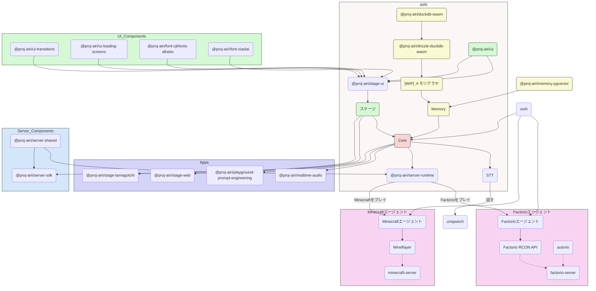

<picture>
  <source
    width="100%"
    srcset="./content/public/banner-dark-1280x640.avif"
    media="(prefers-color-scheme: dark)"
  />
  <source
    width="100%"
    srcset="./content/public/banner-light-1280x640.avif"
    media="(prefers-color-scheme: light), (prefers-color-scheme: no-preference)"
  />
  
</picture>

<h1 align="center">Project AIRI</h1>

<p align="center">Neuro-sama を再創造し、AI waifu / バーチャルキャラクターの魂の器をこの世界へ。</p>
<p align="center">Neuro-sama のようなバーチャルパートナーも、私たちの暮らしの一部に。</p>

<p align="center">
  [<a href="https://discord.gg/TgQ3Cu2F7A">Discordサーバーに参加する</a>] [<a href="https://airi.moeru.ai">試してみる</a>] [<a href="https://github.com/moeru-ai/airi/blob/main/README.md">English</a>] [<a href="https://github.com/moeru-ai/airi/blob/main/docs/README.zh-CN.md">简体中文</a>] [<a href="https://github.com/moeru-ai/airi/blob/main/docs/README.ru-RU.md">Русский</a>] [<a href="https://github.com/moeru-ai/airi/blob/main/docs/README.vi.md">Tiếng Việt</a>] [<a href="https://github.com/moeru-ai/airi/blob/main/docs/README.fr.md">Français</a>] [<a href="https://github.com/moeru-ai/airi/blob/main/docs/README.ko-KR.md">한국어</a>]
</p>

<p align="center">
  <a href="https://deepwiki.com/moeru-ai/airi"></a>
  <a href="https://github.com/moeru-ai/airi/blob/main/LICENSE"></a>
  <a href="https://discord.gg/TgQ3Cu2F7A"></a>
  <a href="https://x.com/proj_airi"></a>
  <a href="https://t.me/+7M_ZKO3zUHFlOThh"></a>
  <a href="./wechat.md"></a>
  <a href="https://qun.qq.com/universal-share/share?ac=1&authKey=9g00d%2BZS7nORzcJugNNddJ7rCghZTIR7fhXabGwch2S%2BG%2BKGIKwlN1N2nIqkh2jg&busi_data=eyJncm91cENvZGUiOiIxMDU4MTU2Njk3IiwidG9rZW4iOiJmcnkra1hWNFIxNytEcG0zcHRUdVJIaldlRDFxN0dzK080QWtvTEdOQjJkNEY2eUFta1g1clNpbkxSMS9FQWFYIiwidWluIjoiMTI2MDkwNzMzNSJ9&data=b1eJrwn3GVOUh7YIxZ7l9vHQo99HPmRxKPpMKlDCmfzx8Y57IXb2EZCMaOC9rVTd2U558qpNjwUYUWlPHxVHvg&svctype=4&tempid=h5_group_info"></a>
</p>


<p float="left" align="center">
  <!-- readme-section:release-binary-windows -->
  <a href="https://github.com/moeru-ai/airi/releases/download/v0.9.0/AIRI-0.9.0-windows-x64-setup.exe">
    <picture>
      <source
        width="33%"
        srcset="./content/public/assets/download-buttons/download-buttons.windows.dark.en-US.avif"
        media="(prefers-color-scheme: dark)"
      />
      <source
        width="33%"
        srcset="./content/public/assets/download-buttons/download-buttons.windows.light.en-US.avif"
        media="(prefers-color-scheme: light), (prefers-color-scheme: no-preference)"
      />
      
    </picture>
  </a>
  <!-- readme-section:release-binary-macos -->
  <a href="https://github.com/moeru-ai/airi/releases/download/v0.9.0/AIRI-0.9.0-darwin-arm64.dmg">
    <picture>
      <source
        width="33%"
        srcset="./content/public/assets/download-buttons/download-buttons.macos.dark.en-US.avif"
        media="(prefers-color-scheme: dark)"
      />
      <source
        width="33%"
        srcset="./content/public/assets/download-buttons/download-buttons.macos.light.en-US.avif"
        media="(prefers-color-scheme: light), (prefers-color-scheme: no-preference)"
      />
      
    </picture>
  </a>
  <a href="https://github.com/moeru-ai/airi/releases/latest">
    <picture>
      <source
        width="33%"
        srcset="./content/public/assets/download-buttons/download-buttons.linux.dark.en-US.avif"
        media="(prefers-color-scheme: dark)"
      />
      <source
        width="33%"
        srcset="./content/public/assets/download-buttons/download-buttons.linux.light.en-US.avif"
        media="(prefers-color-scheme: light), (prefers-color-scheme: no-preference)"
      />
      
    </picture>
  </a>
</p>
<p float="left" align="center">
  <a href="https://airi.moeru.ai">
    <picture>
      <source
        width="33%"
        srcset="./content/public/assets/QR%20code%20button/section.cards.qrcode.dark.ja-JP.png"
        media="(prefers-color-scheme: dark)"
      />
      <source
        width="33%"
        srcset="./content/public/assets/QR%20code%20button/section.cards.qrcode.light.ja-JP.png"
        media="(prefers-color-scheme: light), (prefers-color-scheme: no-preference)"
      />
      
    </picture>
  </a>
  <a href="https://airi.moeru.ai">
    <picture>
      <source
        width="33%"
        srcset="./content/public/assets/download-buttons/download-buttons.mobile.dark.en-US.avif"
        media="(prefers-color-scheme: dark)"
      />
      <source
        width="33%"
        srcset="./content/public/assets/download-buttons/download-buttons.mobile.light.en-US.avif"
        media="(prefers-color-scheme: light), (prefers-color-scheme: no-preference)"
      />
      
    </picture>
  </a>
  <a href="https://airi.moeru.ai">
    <picture>
      <source
        width="33%"
        srcset="./content/public/assets/download-buttons/download-buttons.browser.dark.en-US.png"
        media="(prefers-color-scheme: dark)"
      />
      <source
        width="33%"
        srcset="./content/public/assets/download-buttons/download-buttons.browser.light.en-US.png"
        media="(prefers-color-scheme: light), (prefers-color-scheme: no-preference)"
      />
      
    </picture>
  </a>
</p>

<p align="center">
  <a href="https://www.producthunt.com/products/airi?embed=true&utm_source=badge-featured&utm_medium=badge&utm_source=badge-airi" target="_blank"></a>
  <a href="https://trendshift.io/repositories/14636" target="_blank"></a>
</p>

> [Neuro-sama](https://www.youtube.com/@Neurosama) に大きな影響を受けました

> [!WARNING]
> **ご注意：**
> 当プロジェクトでは、公式の暗号通貨やトークン等は**一切発行しておりません**。誤情報などにご注意ください。

> [!NOTE]
>
> Project AIRIから生まれたすべてのサブプロジェクト用に、専用の組織[@proj-airi](https://github.com/proj-airi)があります。ぜひチェックしてみてください！
>
> RAG、メモリシステム、組み込みデータベース、アイコン、Live2Dユーティリティなど多数あります！

> [!TIP]
> [Crowdin](https://crowdin.com/project/proj-airi) に翻訳プロジェクトがあります。翻訳が不自然・不正確だと感じた場合は、Crowdin で翻訳や修正にご協力ください。
> <a href="https://crowdin.com/project/proj-airi" target="_blank" rel="nofollow"></a>

サイバー生命体（サイバーワイフ、デジタルペット）、あるいは一緒に遊んで話せるデジタルコンパニオンを持つことを夢見たことはありますか？

[ChatGPT](https://chatgpt.com)や有名な[Claude](https://claude.ai)のような最新の大規模言語モデルの力を借りて、仮想存在に役割演技やチャットを求めることは、すでに誰にとっても十分簡単になっています。[Character.ai（別名c.ai）](https://character.ai)や[JanitorAI](https://janitorai.com/)のようなプラットフォーム、そして[SillyTavern](https://github.com/SillyTavern/SillyTavern)のようなローカルな遊び場は、チャットベースや視覚的なアドベンチャーゲームのような体験のための十分な解決策となっています。

> しかし、ゲームをプレイする能力はどうでしょうか？あなたがコーディングしているものを見たり、ゲームをしながらチャットしたり、ビデオを見たり、他の多くのことができる能力は？

おそらく[Neuro-sama](https://www.youtube.com/@Neurosama)をすでに知っているでしょう。彼女は現在、ゲームをプレイし、チャットし、あなたや参加者（VTuberコミュニティ内）と対話できる最高のコンパニオンです。この種の存在を「デジタルヒューマン」と呼ぶ人もいます。**残念ながら、オープンソースではないため、ライブストリームがオフラインになった後は彼女と対話することはできません**。

そのため、このプロジェクトAIRIは、ここで別の可能性を提供します：**簡単に、どこでも、いつでも、あなた自身のデジタルライフ、サイバー生活を所有できるようにします**。

## 投稿した DevLog と最近のアップデート

- [DevLog @ 2026.01.01](https://airi.moeru.ai/docs/en/blog/DevLog-2026.01.01/) — 2026/01/01
- [DevLog @ 2025.10.20](https://airi.moeru.ai/docs/en/blog/DevLog-2025.10.20/) — 2025/10/20
- [DevLog @ 2025.08.05](https://airi.moeru.ai/docs/en/blog/DevLog-2025.08.05/) — 2025/08/05
- [DevLog @ 2025.08.01](https://airi.moeru.ai/docs/en/blog/DevLog-2025.08.01/) — 2025/08/01
- [DevLog @ 2025.07.18](https://airi.moeru.ai/docs/en/blog/DevLog-2025.07.18/) — 2025/07/18
- [DreamLog 0x1](https://airi.moeru.ai/docs/en/blog/dreamlog-0x1/) — 2025/06/16
- ...そのほかは[ドキュメントサイト](https://airi.moeru.ai/docs/en/)で

## このプロジェクトの特別な点は？

他のAI駆動のVTuberオープンソースプロジェクトとは異なり、アイリVTuberは開発初日から[WebGPU](https://www.w3.org/TR/webgpu/)、[WebAudio](https://developer.mozilla.org/en-US/docs/Web/API/Web_Audio_API)、[Web Workers](https://developer.mozilla.org/en-US/docs/Web/API/Web_Workers_API/Using_web_workers)、[WebAssembly](https://webassembly.org/)、[WebSocket](https://developer.mozilla.org/en-US/docs/Web/API/WebSocket)などの多くのWeb技術をサポートしています。

> [!TIP]
> 「Web技術だとパフォーマンスが落ちない？」と心配ですか？
>
> ご安心を。ブラウザ版はブラウザやWebViewでどこまでできるかを示すためのものですが、そこに完全依存しません。デスクトップ版 AIRI は標準で [NVIDIA CUDA](https://developer.nvidia.com/cuda-toolkit) と [Apple Metal](https://developer.apple.com/metal/) を扱えます（HuggingFace と愛すべき [candle](https://github.com/huggingface/candle) に感謝）。依存管理も複雑ではなく、グラフィックス・レイアウト・アニメーション・プラグインシステム（WIP）は Web 技術を組み合わせつつ、いいとこ取りしています。

これは、**アイリVTuberが現代のブラウザやデバイスで動作可能である**ことを意味し、モバイルデバイスでも動作します（PWAサポート済み）。これにより、私たち（開発者）はアイリVTuberの力を次のレベルに引き上げるための多くの可能性を持ちつつ、ユーザーがTCP接続や他の非Web技術を必要とする機能を有効にする柔軟性を残しています。例えば、Discordのボイスチャネルに接続したり、MinecraftやFactorioを友達と一緒にプレイすることができます。

> [!NOTE]
>
> 私たちはまだ開発の初期段階にあり、才能ある開発者を探しています。アイリVTuberを現実のものにするために私たちを助けてください。
>
> Vue.js、TypeScript、またはこのプロジェクトに必要な開発ツールに慣れていなくても大丈夫です。アーティスト、デザイナー、または最初のライブストリームを立ち上げる手助けをすることもできます。
>
> ReactやSvelte、Solidの大ファンであっても歓迎します。アイリVTuberに見たい機能を追加したり、実験したい機能を追加するためのサブディレクトリを開くことができます。
>
> 私たちが探している分野（および関連プロジェクト）：
>
> - Live2Dモデラー
> - VRMモデラー
> - VRChatアバターデザイナー
> - コンピュータビジョン
> - 強化学習
> - 音声認識
> - 音声合成
> - ONNXランタイム
> - Transformers.js
> - vLLM
> - WebGPU
> - Three.js
> - WebXR（@moeru-ai組織の[別のプロジェクト](https://github.com/moeru-ai/chat)もチェックしてください）
>
> **興味があるなら、ここで自己紹介してみませんか？ [Would like to join part of us to build AIRI?](https://github.com/moeru-ai/airi/discussions/33)**

## 現在の進捗

可能なこと

- [x] 脳
  - [x] [Minecraft](https://www.minecraft.net)をプレイ
  - [x] [Factorio](https://www.factorio.com)をプレイ（進行中ですが、[PoCとデモが利用可能](https://github.com/moeru-ai/airi-factorio)）
  - [x] [Telegram](https://telegram.org)でチャット
  - [x] [Discord](https://discord.com)でチャット
  - [ ] メモリ
    - [x] ブラウザ内データベースサポート（DuckDB WASM | `pglite`）
    - [ ] メモリアラヤ（進行中）
  - [ ] ブラウザ内ローカル（WebGPU）推論
- [x] 耳
  - [x] ブラウザからの音声入力
  - [x] [Discord](https://discord.com)からの音声入力
  - [x] クライアント側の音声認識
  - [x] クライアント側の話し声検出
- [x] 口
  - [x] [ElevenLabs](https://elevenlabs.io/)音声合成
- [x] 体
  - [x] VRMサポート
    - [x] VRMモデルの制御
  - [x] VRMモデルのアニメーション
    - [x] 自動まばたき
    - [x] 自動視線追従
    - [x] アイドル時の目の動き
  - [x] Live2Dサポート
    - [x] Live2Dモデルの制御
  - [x] Live2Dモデルのアニメーション
    - [x] 自動まばたき
    - [x] 自動視線追従
    - [x] アイドル時の目の動き

## 開発

> このプロジェクトの詳細な開発手順については、[CONTRIBUTING.md](../.github/CONTRIBUTING.md)を参照してください

> [!NOTE]
> デフォルトで `pnpm dev` は Stage Web（ブラウザ版）の開発サーバーを起動します。デスクトップ版を試す場合は、まず [CONTRIBUTING.md](../.github/CONTRIBUTING.md) を読み、環境を正しくセットアップしてください。

```shell
pnpm i
pnpm dev
```

### ステージウェブ（ブラウザ版）

```shell
pnpm dev
```

### ステージたまごっち（デスクトップアプリ）

```shell
pnpm dev:tamagotchi
```

たまごっち用の Nix パッケージも用意しています。flakes を有効化した上で、次のように実行できます：

```shell
nix run github:moeru-ai/airi
```

### ドキュメントサイト

```shell
pnpm dev:docs
```

### リリース

`bumpp` を実行してモノレポのバージョンを更新してください：

```shell
npx bumpp --no-commit --no-tag
```

## サポートされているLLM APIプロバイダー（[xsai](https://github.com/moeru-ai/xsai)によって提供）

- [x] [AIHubMix (recommended)](https://aihubmix.com/?aff=OOiX)
- [x] [OpenRouter](https://openrouter.ai/)
- [x] [vLLM](https://github.com/vllm-project/vllm)
- [x] [SGLang](https://github.com/sgl-project/sglang)
- [x] [Ollama](https://github.com/ollama/ollama)
- [x] [302.AI (sponsored)](https://share.302.ai/514k2v)
- [x] [OpenAI](https://platform.openai.com/docs/guides/gpt/chat-completions-api)
  - [ ] [Azure OpenAI API](https://learn.microsoft.com/en-us/azure/ai-services/openai/reference)（PR歓迎）
- [x] [Anthropic Claude](https://anthropic.com)
  - [ ] [AWS Claude](https://learn.microsoft.com/en-us/azure/ai-services/openai/reference)（PR歓迎）
- [x] [DeepSeek](https://www.deepseek.com/)
- [x] [Qwen](https://help.aliyun.com/document_detail/2400395.html)
- [x] [Google Gemini](https://developers.generativeai.google)
- [x] [xAI](https://x.ai/)
- [x] [Groq](https://wow.groq.com/)
- [x] [Mistral](https://mistral.ai/)
- [x] [Cloudflare Workers AI](https://developers.cloudflare.com/workers-ai/)
- [x] [Together.ai](https://www.together.ai/)
- [x] [Fireworks.ai](https://www.together.ai/)
- [x] [Novita](https://www.novita.ai/)
- [x] [Zhipu](https://bigmodel.cn)
- [x] [SiliconFlow](https://cloud.siliconflow.cn/i/rKXmRobW)
- [x] [Stepfun](https://platform.stepfun.com/)
- [x] [Baichuan](https://platform.baichuan-ai.com)
- [x] [Minimax](https://api.minimax.chat/)
- [x] [Moonshot AI](https://platform.moonshot.cn/)
- [x] [ModelScope](https://modelscope.cn/docs/model-service/API-Inference/intro)
- [x] [Player2](https://player2.game/)
- [x] [Tencent Cloud](https://cloud.tencent.com/document/product/1729)
- [ ] [Sparks](https://www.xfyun.cn/doc/spark/Web.html)（PR歓迎）
- [ ] [Volcano Engine](https://www.volcengine.com/experience/ark?utm_term=202502dsinvite&ac=DSASUQY5&rc=2QXCA1VI)（PR歓迎）

## このプロジェクトから生まれたサブプロジェクト

- [Awesome AI VTuber](https://github.com/proj-airi/awesome-ai-vtuber): AI VTuberと関連プロジェクトのキュレーションリスト
- [`unspeech`](https://github.com/moeru-ai/unspeech): `/audio/transcriptions` と `/audio/speech` のユニバーサルエンドポイントプロキシ、LiteLLM 的に任意の ASR/TTS に対応
- [`hfup`](https://github.com/moeru-ai/hfup): HuggingFace Spaces へのデプロイとバンドルを支援するツール
- [`xsai-transformers`](https://github.com/moeru-ai/xsai-transformers): [xsAI](https://github.com/moeru-ai/xsai)向けの実験的な [🤗 Transformers.js](https://github.com/huggingface/transformers.js) プロバイダー
- [WebAI: Realtime Voice Chat](https://github.com/proj-airi/webai-realtime-voice-chat): VAD + STT + LLM + TTS で ChatGPT のリアルタイム音声をゼロから実装する完全例
- [`@proj-airi/drizzle-duckdb-wasm`](https://github.com/moeru-ai/airi/tree/main/packages/drizzle-duckdb-wasm/README.md): DuckDB WASM の Drizzle ORM ドライバー
- [`@proj-airi/duckdb-wasm`](https://github.com/moeru-ai/airi/tree/main/packages/duckdb-wasm/README.md): 使いやすい `@duckdb/duckdb-wasm` ラッパー
- [AIRI Factorio](https://github.com/moeru-ai/airi-factorio): AIRI が Factorio をプレイできるようにする
- [Factorio RCON API](https://github.com/nekomeowww/factorio-rcon-api): Factorio ヘッドレスサーバーコンソールの RESTful API ラッパー
- [`autorio`](https://github.com/moeru-ai/airi-factorio/tree/main/packages/autorio): Factorio 自動化ライブラリ
- [`tstl-plugin-reload-factorio-mod`](https://github.com/moeru-ai/airi-factorio/tree/main/packages/tstl-plugin-reload-factorio-mod): Factorio モッド開発時のリロードを支援
- [Velin](https://github.com/luoling8192/velin): Vue SFC と Markdown で管理しやすいプロンプトを書く仕組み
- [`demodel`](https://github.com/moeru-ai/demodel): さまざまな推論ランタイム/ダウンローダーでモデルやデータセット取得を加速
- [`inventory`](https://github.com/moeru-ai/inventory): モデルカタログとデフォルトプロバイダー設定のバックエンドサービス
- [MCP Launcher](https://github.com/moeru-ai/mcp-launcher): すべての MCP サーバーを簡単に扱える MCP ビルダー＆ランチャー、モデル界の Ollama 的存在
- [🥺 SAD](https://github.com/moeru-ai/sad): 自己ホストやブラウザで動かす LLM のドキュメントとノート



## 類似プロジェクト

### オープンソースのもの

- [kimjammer/Neuro: A recreation of Neuro-Sama originally created in 7 days.](https://github.com/kimjammer/Neuro): 非常に完成度の高い実装
- [SugarcaneDefender/z-waif](https://github.com/SugarcaneDefender/z-waif): ゲーム、自律エージェント、プロンプトエンジニアリングに優れています
- [semperai/amica](https://github.com/semperai/amica/): VRM、WebXRに優れています
- [elizaOS/eliza](https://github.com/elizaOS/eliza): エージェントをさまざまなシステムやAPIに統合するための優れた例
- [ardha27/AI-Waifu-Vtuber](https://github.com/ardha27/AI-Waifu-Vtuber): Twitch APIの統合に優れています
- [InsanityLabs/AIVTuber](https://github.com/InsanityLabs/AIVTuber): 素晴らしいUIとUX
- [IRedDragonICY/vixevia](https://github.com/IRedDragonICY/vixevia)
- [t41372/Open-LLM-VTuber](https://github.com/t41372/Open-LLM-VTuber)
- [PeterH0323/Streamer-Sales](https://github.com/PeterH0323/Streamer-Sales)

### 非オープンソースのもの

- https://clips.twitch.tv/WanderingCaringDeerDxCat-Qt55xtiGDSoNmDDr https://www.youtube.com/watch?v=8Giv5mupJNE
- https://clips.twitch.tv/TriangularAthleticBunnySoonerLater-SXpBk1dFso21VcWD
- https://www.youtube.com/@NOWA_Mirai

## プロジェクトのステータス


## 謝辞

- [Reka UI](https://github.com/unovue/reka-ui): ドキュメントサイトのデザイン。新しいランディングページもここをベースに、膨大な UI コンポーネントに感謝。（shadcn-vue は headless として Reka UI を採用、ぜひチェックを）
- [pixiv/ChatVRM](https://github.com/pixiv/ChatVRM)
- [josephrocca/ChatVRM-js: A JS conversion/adaptation of parts of the ChatVRM (TypeScript) code for standalone use in OpenCharacters and elsewhere](https://github.com/josephrocca/ChatVRM-js)
- UI とスタイルは [Cookard](https://store.steampowered.com/app/2919650/Cookard/)、[UNBEATABLE](https://store.steampowered.com/app/2240620/UNBEATABLE/)、[Sensei! I like you so much!](https://store.steampowered.com/app/2957700/_/)、[Ayame by Mercedes Bazan](https://dribbble.com/shots/22157656-Ayame)、[Wish by Mercedes Bazan](https://dribbble.com/shots/24501019-Wish) などにインスパイアされています
- [mallorbc/whisper_mic](https://github.com/mallorbc/whisper_mic)
- [`xsai`](https://github.com/moeru-ai/xsai): LLMやモデルと対話するための多くのパッケージを実装しました。 [Vercel AI SDK](https://sdk.vercel.ai/)のように小さなものです。

## サポーター

<p align="center">
  <strong>OpenCollective、Patreon、Ko-fi からのご支援ありがとうございます。</strong>
</p>

<p align="center">
  
</p>

## 特別の感謝

Project AIRIへの貢献に対して、すべての貢献者に特別の感謝を捧げます ❤️

<a href="https://github.com/moeru-ai/airi/graphs/contributors">
  
</a>

## スター履歴

<a href="https://star-history.com/#moeru-ai/airi&Date">
  <picture>
    <source media="(prefers-color-scheme: dark)" srcset="https://api.star-history.com/svg?repos=moeru-ai/airi&type=Date&theme=dark" />
    <source media="(prefers-color-scheme: light)" srcset="https://api.star-history.com/svg?repos=moeru-ai/airi&type=Date" />
    
  </picture>
</a>
